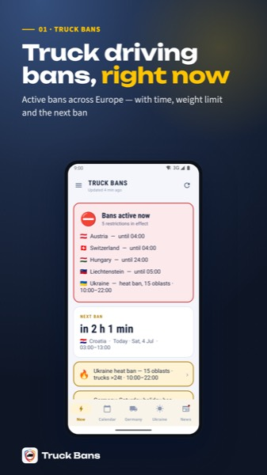
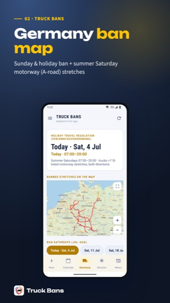
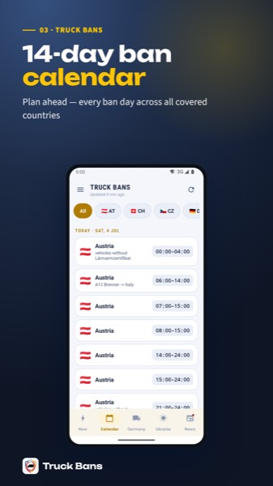
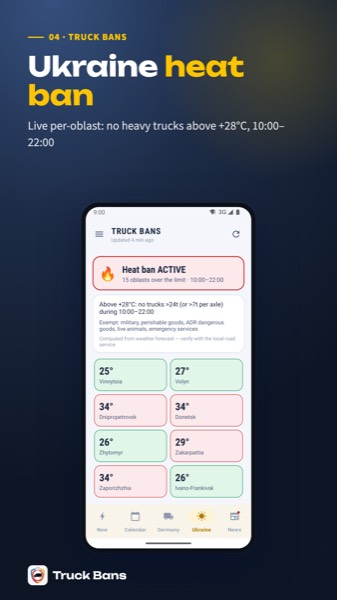

[English](README.md) | [Deutsch](README.de.md) | **Українська** | [Français](README.fr.md) | [Español](README.es.md) | [Italiano](README.it.md)

# Truck Bans

### Чи можуть сьогодні їхати вантажівки? Дізнайтеся до відправлення.

Truck Bans — швидкий довідник заборон руху вантажівок у Європі, створений насамперед для водіїв: заборони у неділі та святкові дні, німецька літня заборона по суботах, нічні заборони та українське обмеження через спеку, з часом дії, обмеженнями за вагою, штрафами та винятками.

## Завантажити

 

## Можливості

- **Заборони, що діють зараз**: країна, час завершення та мінімальна вага одним поглядом
- **Відлік до наступної заборони**: що почнеться далі й коли
- **14-денний календар заборон** для планування маршрутів
- **Штрафи та винятки для кожної країни**, зокрема хто звільняється
- **Німеччина**: заборона у неділі та свята, літня заборона по суботах із мапою відповідних ділянок автобанів
- **Україна**: заборона через спеку по областях
- **Новини про заборони**: зміни правил, свята та перекриття
- **Стежте лише за потрібними країнами**; темна й світла теми, робота офлайн, понад 20 мов

## Скриншоти

   

> Truck Bans — незалежний інформаційний сервіс, а не офіційна державна служба. Інформація має довідковий характер; перед поїздкою завжди перевіряйте її в місцевого дорожнього органу.

## Посилання

- Вебсайт: https://truckbans.com
- Сторінка застосунку: https://nakordoni.eu/en/apps/truckban/
- Більше застосунків: https://nakordoni.eu/en/apps/

---

© nakordoni.eu, всі права захищено.

Пропрієтарне програмне забезпечення. Цей репозиторій — лише вітрина продукту; ліцензія на повторне використання будь-яких матеріалів не надається.
